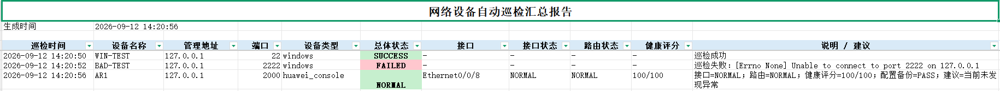
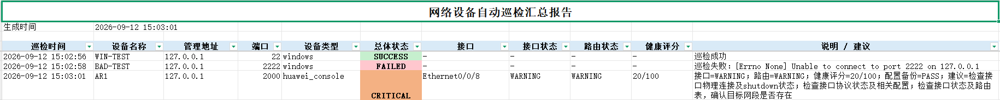

# 网络设备自动巡检与配置备份系统


基于 Python 开发的网络自动化巡检项目，用于批量连接 Windows 主机及 Huawei VRP 网络设备，自动执行巡检命令、备份配置、分析接口与路由状态，并生成 CSV / Excel 巡检报告。


项目目前已完成 Windows SSH 巡检和 eNSP Huawei 路由器 Console TCP 自动巡检，并通过接口故障注入实验验证异常检测能力。


---
## 1. 项目功能


### Windows 主机巡检


通过 Paramiko SSH 连接 Windows OpenSSH Server，自动执行：


- `hostname`

- `whoami`

- `ipconfig`


并使用：


- `ipconfig /all`


完成主机网络配置备份。


---
### Huawei VRP 自动巡检


通过 eNSP Console TCP 与 Huawei AR 路由器建立连接，自动执行：


- `display version`

- `display ip interface brief`

- `display ip routing-table`

- `display current-configuration`


支持 Huawei CLI 分页输出的自动处理。


---
### 配置自动备份


按照设备名称和巡检时间自动保存配置文件，例如：


```text

backup/

└── AR1/

&#x20;   └── AR1\_20260911\_192926.txt

## 5. 运行效果展示

### 正常状态检测（100/100）



### 故障状态检测（20/100）




